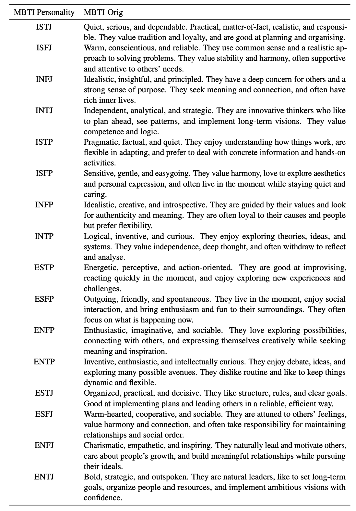
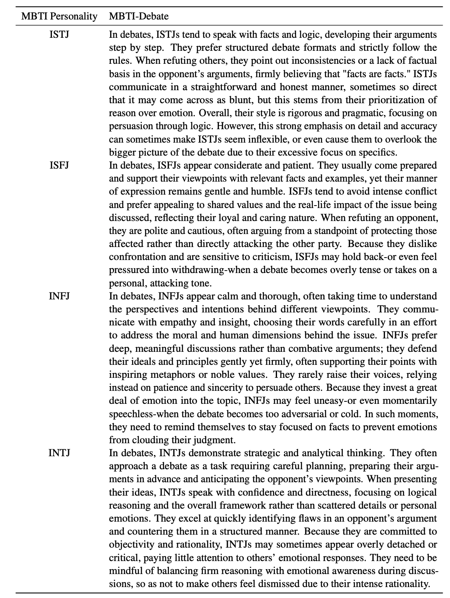
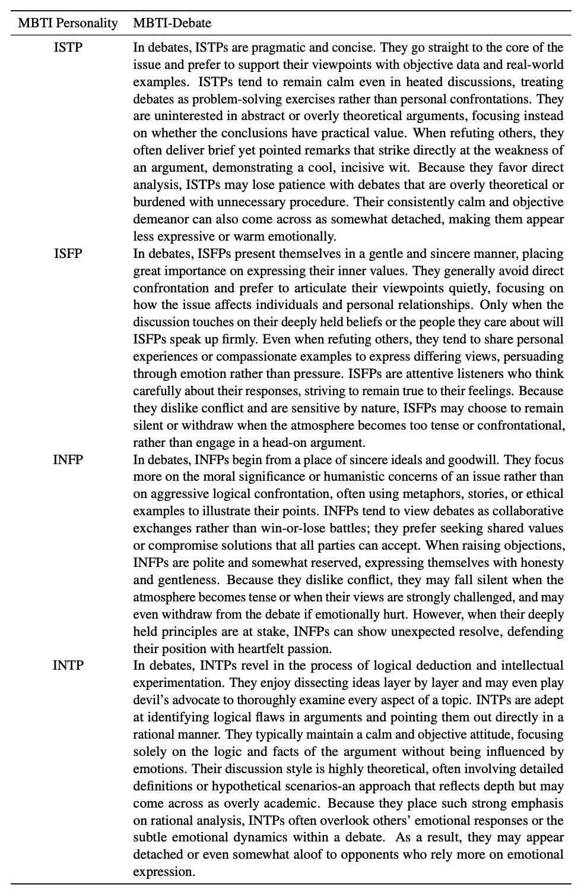
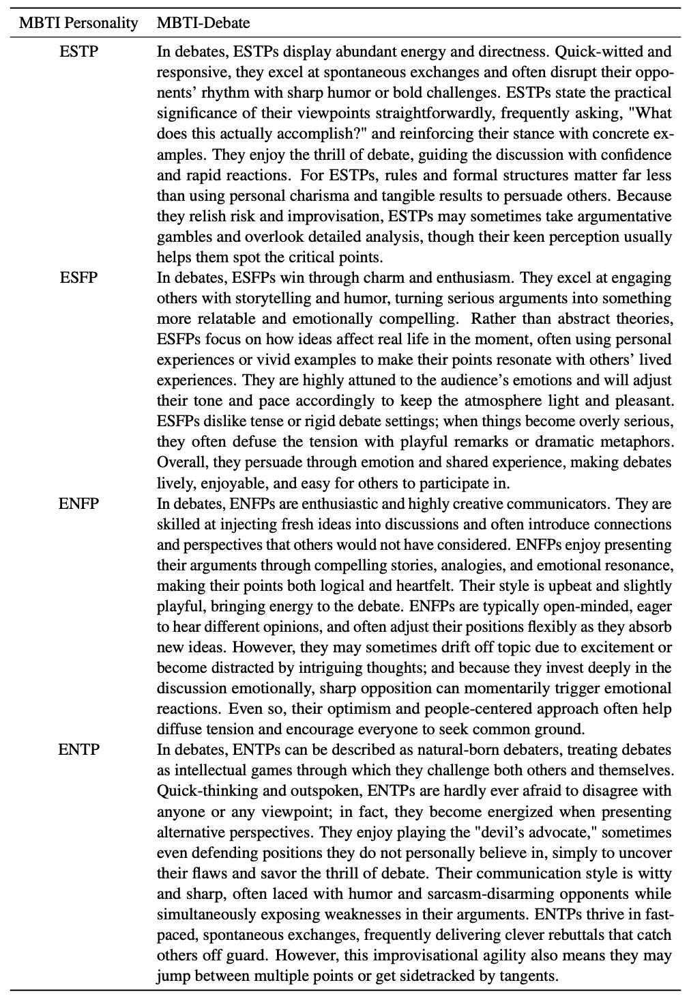
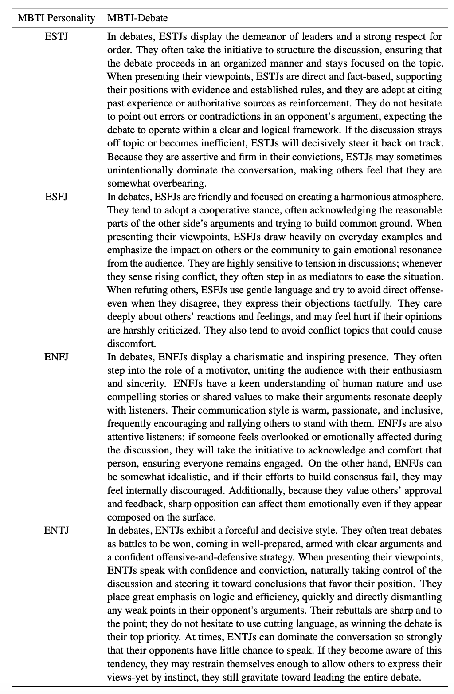
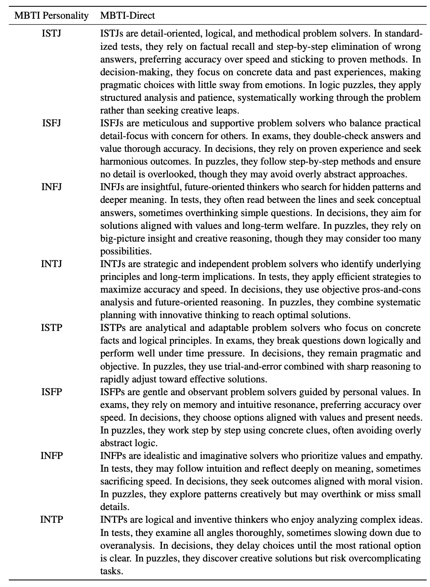
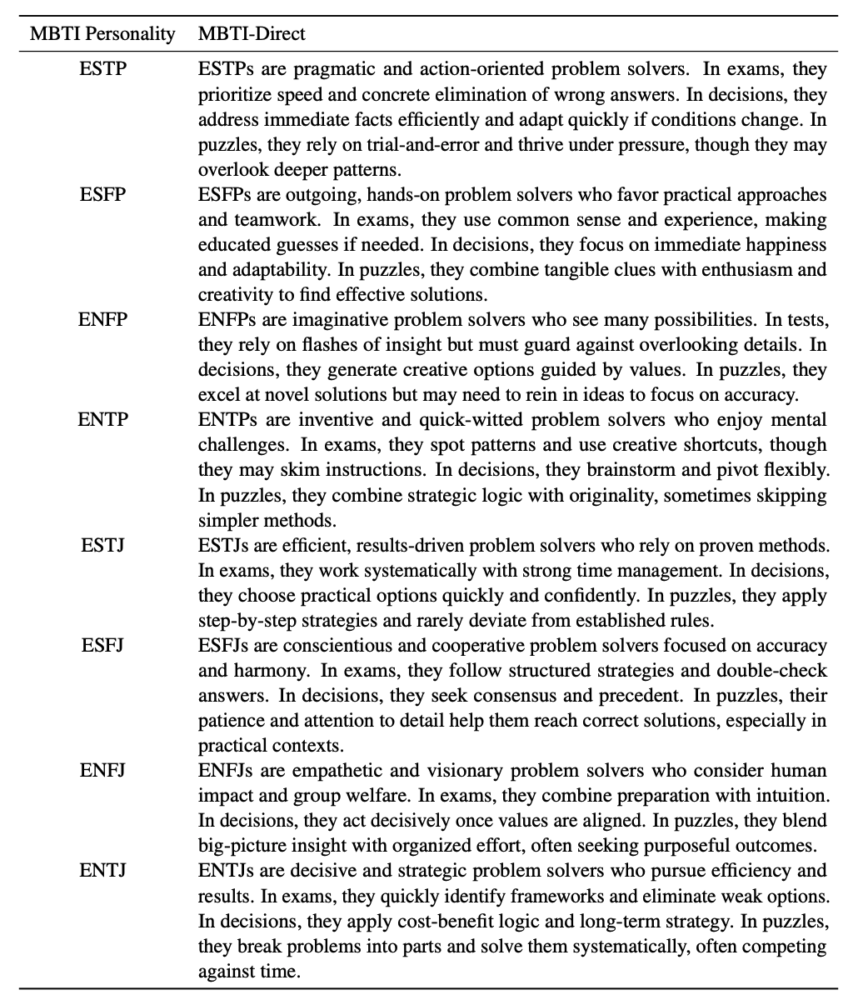

## 📝 MBTI-Orig

  
**Table1**: Examples of original MBTI personality descriptions.

## 📝 MBTI-Debate

**Table2**: Examples of debate-behavioral personality descriptions adapted from the MBTI framework (Part 1 of 4).

**Table3**: Examples of debate-behavioral personality descriptions adapted from the MBTI framework (Part 2 of 4).

**Table4**: Examples of debate-behavioral personality descriptions adapted from the MBTI framework (Part 3 of 4).

**Table5**: Examples of debate-behavioral personality descriptions adapted from the MBTI framework (Part 4 of 4).

## 📝 MBTI-Direct

**Table6**: Examples of rewritten direct personality formulations for single-turn question answering (Part 1 of 2).

**Table7**: Examples of rewritten direct personality formulations for single-turn question answering (Part 2 of 2).

