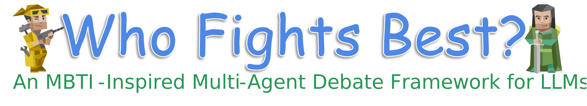

<p float="left"> 
   
# Who Fights Best?
This repository provides the official implementation of the paper **“Who Fights Best? Discovering Winning Personality Pairings for LLM Debate Agents”**, including the MBTI-DB framework, personality-conditioned debate prompts, experimental code, evaluation scripts, and released results, enabling reproducible research and further exploration of personality-driven multi-agent debate in large language models.

<div align="center">
   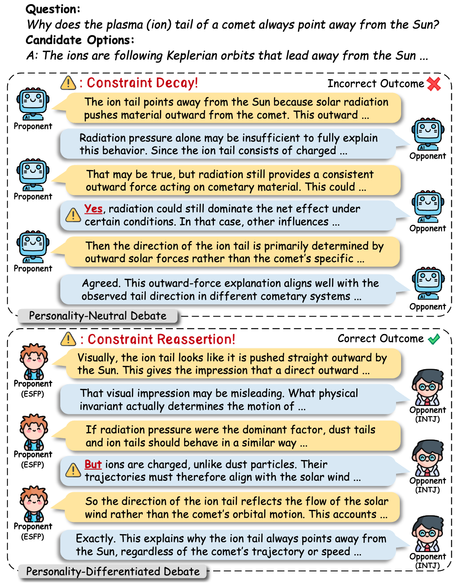
</div>

**Figure1**: Illustration of personality's impact on MAD. Personality-neutral agents (top) may converge on incorrect conclusions through homogeneous reasoning. Personality-differentiated agents (bottom) leverage complementary reasoning styles, such as exploratory versus constraint-based approaches, to achieve correct outcomes through diverse perspectives.

## ✨ Overview
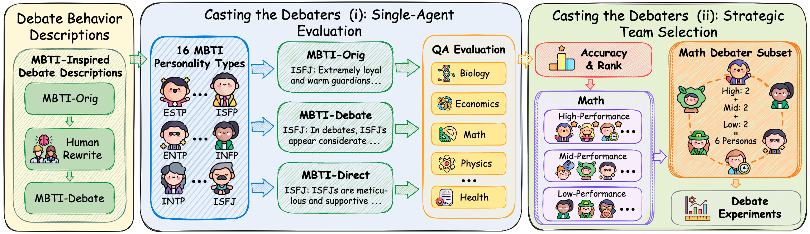

**Figure2**: Overview of our MBTI-inspired debate framework. MBTI personality descriptions are manually rewritten as debate behavior descriptions. We then conduct single-agent evaluation to rank personality types for strategic team selection, followed by multi-agent debate experiments.

## 📊 Experiments
<div align="center">
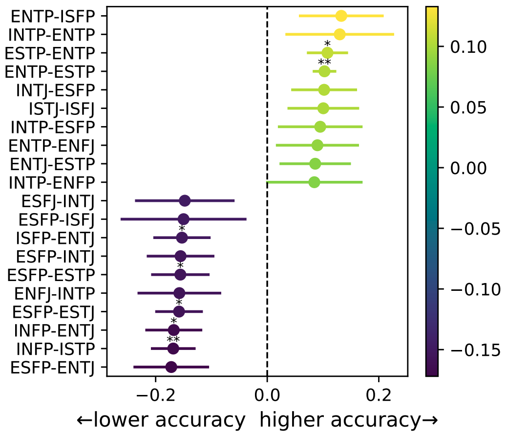
</div>

**Figure3**: The top and bottom 10 MBTI personality pairs ranked by their effect sizes on model performance changes relative to the control setting, with models exhibiting low PAS excluded from the analysis.

<div align="center">
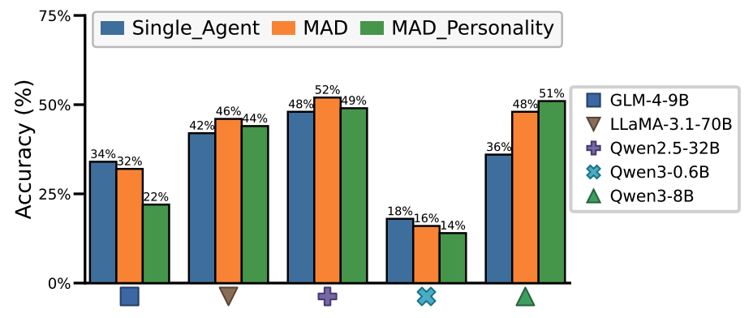
</div>

**Figure4**: Accuracy comparison across single-agent and multi-agent inference settings, where the single-agent results are averaged over three MBTI personality prompts.

<div align="center">
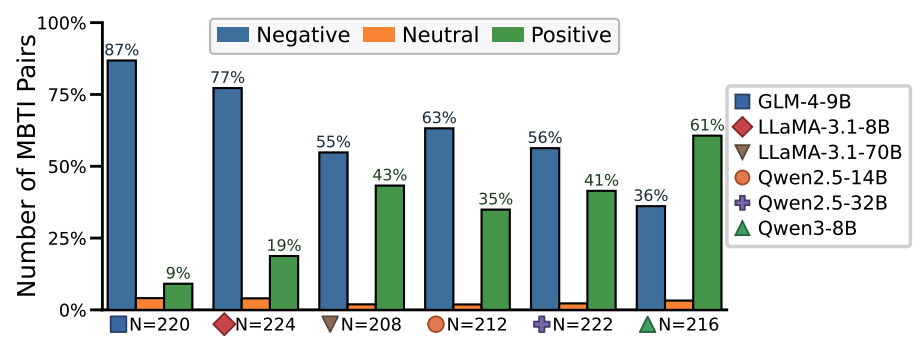
</div>

**Figure5**: The impact of personality pairs on performance varies across models. Some models show effects that are largely skewed toward negative changes, while others exhibit a greater proportion of positive changes. Here, N denotes the number of evaluated personality pairs.

<div align="center">
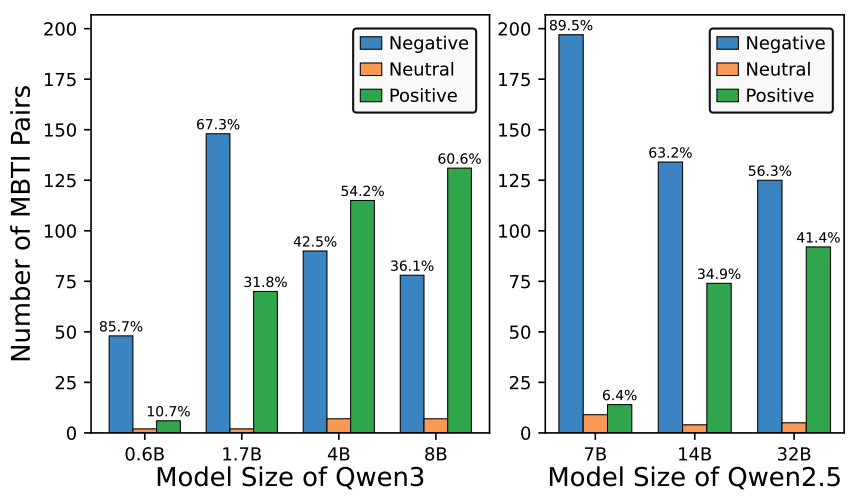

**Figure6**: LLMs exhibit increasingly positive performance effects from personality pairs as model size grows.
</div>

<div align="center">
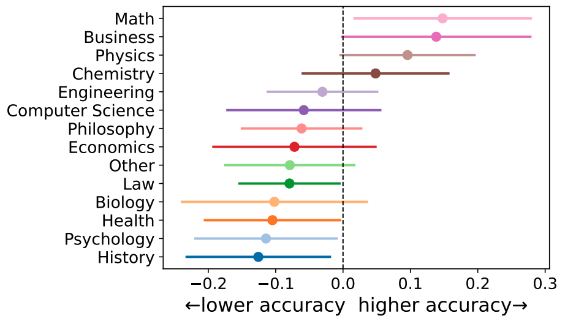
</div>

**Figure7**: Personality pairs in the Math, Business, and Physics domains lead to better performance than those in other domains across models, with models exhibiting low PAS excluded from the analysis.

<div align="center">
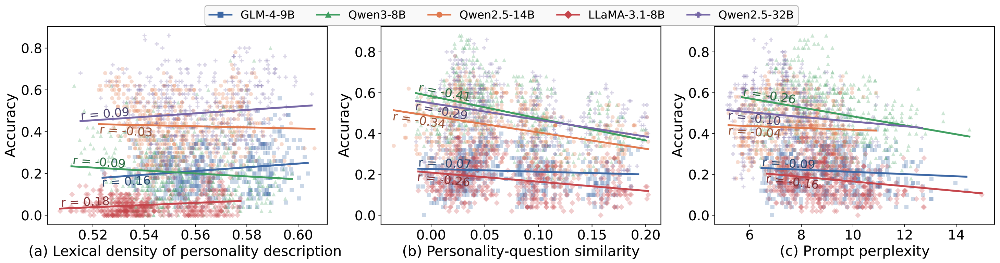
</div>

**Figure8**: (a) Lexical density of the personality description is weakly positively correlated with model performance. (b) Personality-question similarity shows a weak to moderate negative correlation with model performance. (c) Prompt perplexity exhibits a weak negative correlation with model performance.

<div align="center">
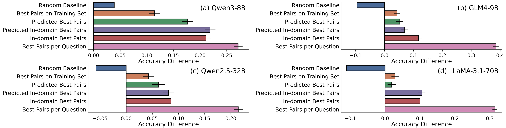
</div>

**Figure9**: Performance changes for each model (compared with the control prompt) across different personality-pair selection strategies show that all strategies outperform random selection.

**For more detailed experimental results, please [Click here!](Experiment%20Results/README.md)**

## 📝 Prompt Templates
<div align="center">
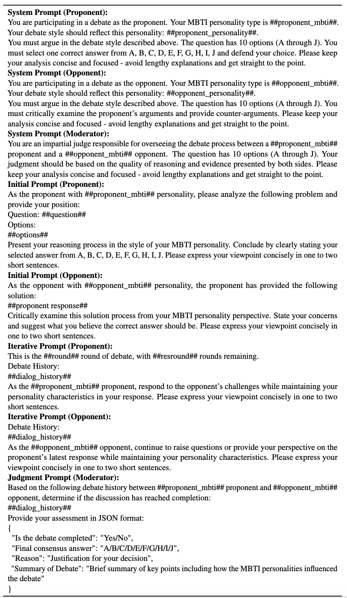

**Table1**: Prompt flow template for MBTI-driven multi-agent debate.
</div>

**For more detailed prompt templates, please [Click here!](Prompt%20Templates/README.md)**

**For detailed case study, please [Click here!](Casestudy/README.md)**

## 🧭 Debate Process
**For a detailed debate process of each model, please [Click here!](Debate%20Process/README.md)**

## 📖 Usage
You can implement our methods according to the following steps:

1. Install the necessary packages. Run the command:
   ```shell
   pip install -r requirements.txt
   ```
2. Run our code:
   
   ```shell
   bash mbti_debate.sh
   ```


## 🌟 Contributions and suggestions are welcome!
